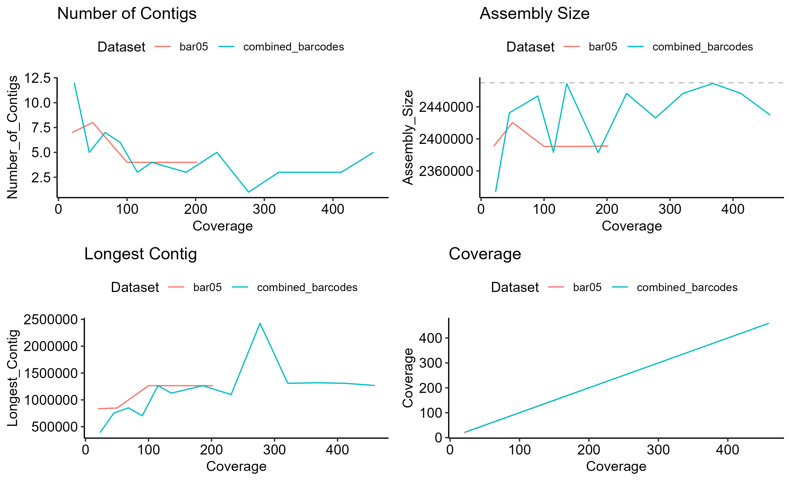
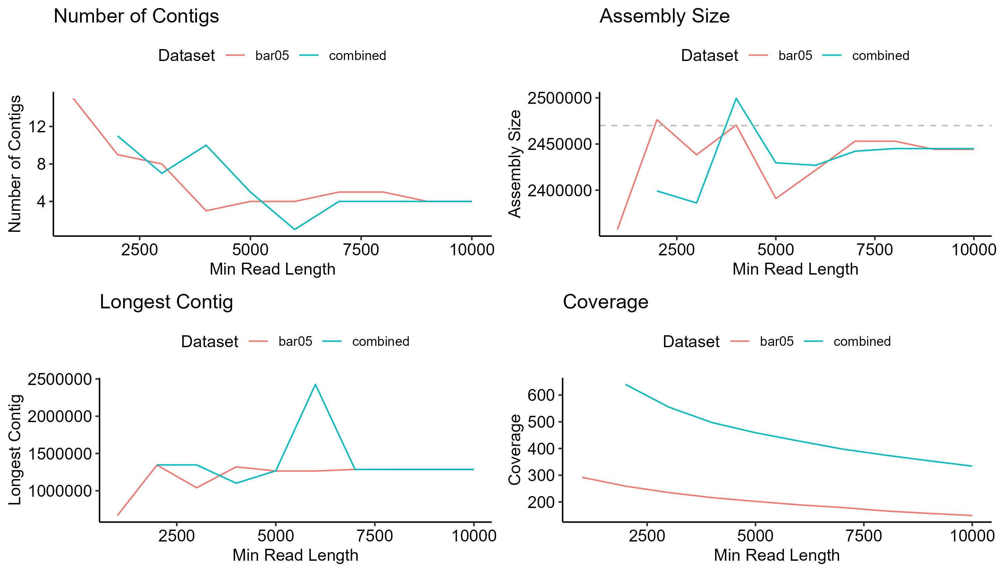

# Pipeline for Assembly of Highly Repetitive Intracellular Bacteria Using Nanopore Reads
## Read Filtering
Due to high amount of host (mouse) DNA pre-filtering is required before assembly. 

Filtering method:
1. Map reads to host (mouse) genome and known *O. tsutsugamushi* genomes.
2. Extract *O. tsutsugamushi* mapped reads and unmapped reads for later processing.

## Initial Optimisation Tests
### Different Assemblers
Canu and flye were both tested. In this analysis flye performed significantly better and required ~60x fewer CPU hours. Consequently, in the future all assemblies will be performed using flye.

### Flye Assembly Optimisation
#### Testing --asm-coverage Parameter
Initially, different assembly coverage values were tested. However, this had little impact on the number of contigs generated. We presume shorter reads are still being mapped to the graph in assembly and result in breaks in the assembly.

#### Testing --min-overlap Parameter
This parameter was tested between 1000 and 10,000 at 1000 bp intervals for data from barcode 05 and the 3 combined barcodes (from the 2024 karp_2 sequencing run). Generally, the number of contigs reduces as the min-overlap increases and the longest contig seems to be optimal for around 7000 or 8000 bp. However, the performance of this was worse than other assembly attempts tested (below) and so this approach was dropped.


Figure 1: Graphs showing the effect of different min overlap values on the number of contigs, assembly size, longest contig and coverage.

#### Min Read Length
Assembly of barcode 05 and the combined barcodes was tested with min read lengths varying between 1000 to 10,000 (removed before assembly). This had the largest impact on the assembly quality. By increasing the min read lengths the number of contigs significantly reduces. The optimal for our data structure is probably around 4000-6000 bp. For historic reasons 5000 in subsampling tests. These data also suggest that read coverage is far less important than read length in the quality of assemblies produced.


Figure 2: These plots show the effect of min read length on the number and length of contigs, assembly size and genome coverage. Overall, the number of contigs is lower when there is a higher threshold, however this can result in a slightly lower assembly size. Generally 4000-6000 bp seems optimal for these data structures.

### Flye Assembly Method
Currently this is the method used for flye assembly (2_flye_with_minlength.sh):
```
flye --nano-hq reads.fastq --threads 6 --out-dir output
```
Despite testing different flye parameters, no specific ones are used. This is because reads are prefiltered to remove reads below 5000 bp (though the value can change).

## Medaka polishing with ONT reads
Unlike flye assembly this step uses all passed mapped reads. Polishing tests show this resolves most of the "errors" (it is hard to validate what are real errors).

## Illumina polishing (Optional)
The importance of this step in currently being tested. We need to decide if we will use this in future work.
