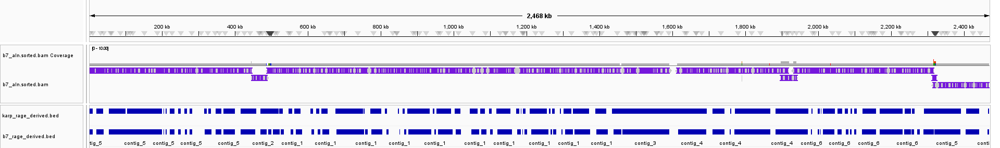

# Annotation of RAGE regions
## Code structure 
1. Defining RAGE derived regions
2. Defining boundaries for complete RAGEs
3. Validating boundaries within RAGE derived regions
4. Identifying complete RAGEs based on required genes

These stages are tied together in the script `main.sh` so that processing of genbank files can be performed in one stage to define the RAGEs derived regions and complete RAGEs. Output files .bed files.

### Code usage
1. Create and activate the rage conda environment. This can be created from `rage_environment.yml`.
2. The script can be run like this (locally, not adjusted for the cluster):  `bash ../main.sh <gbff_file> <gbff_file> ... <gbff_file>`. 

## RAGE derived regions
These are currently defined by a list of different rage genes. These were determined by identifying genes in the bakta annotation which were considered in RAGE regions by Jeanne's paper. 

This list of RAGE genes was generated from the Karp, Gilliam and Boryong genomes, then tested on other genomes to validate the success.

### Visualising success

This IGV image of the different boundaries shows that my script closely resembles the manual annotations (note manual annotations have additional breaks for boundaries between RAGEs). The 2 lines below the manual annotated boundaries shows the effects of allowing one or 2 mis-matched genes within a RAGE region.

The effect here is not that large and so the current script only allows 1 non-match. However it can easily be modified to permit 2. The code was developed to permit this, and also not to allow these non-matches to be adjacent to eachother. 

### Rules for the RAGE derived regions
1. Needs to be more than 2 genes next to eachother
2. A region can contain a single non-matched gene (but not at the edges)
3. Genes must match the `RAGE_gene_list` but they cannot match to the `exclusion_list` (this was generated so that genes which match the list but contain more information and should be excluded)

## Complete RAGE boundaries
### Rules for boundaries are:

The black lines mark the boundary, if a gene is not included in the boundary then the script will restart on this line to identify additional boundaries using this gene.

Currently for the boundaries, genes can be shared from one RAGE to the next. In pactice this doesn't really happen, as the frequency of RAGEs is very low.

## Validating boundaries
Boundaries identified are validated against the RAGE derived regions. Only those contained within this .bed file are kept for required gene testing. This step uses the package bed tools.

## Testing for required genes
To be a complete RAGE, it must have the boundries (already identified), all tra genes, at least 1 transposase and at least 1 cargo gene (currently using those defined in the paper). The presence of these genes is tested on the validated boundaries and the regions which meet these criteria are outputted in a new .bed file.

## Current results
Currently identifying 5 complete rages (2 new and potentially complete, Karp_73 and UT76_10), is mis-hitting with kato_02 (not recognising a truncated integrase) and misses kato_59 (integrase not recoginsed as complete).

## RAGE gene completeness
Overclassification of RAGEs, is a result of truncated or degraded genes not being identified. Using a Blast+ script 

Method:
1. Blast+ search of the genomes genes against a database of complete tra genes and complete integrases
2. Testing the percentage of the genome aligned

This was successful in identifying >95% of all cases (when testing 7 genomes using a db of the 8th), consequently the coverage will be increased when the all 8 are used in the db.

## Handling Contigs
I modified the script to handle contigs by spliting the input txt files and then joining the outputs. 

Note: this diagram is illustrative, but as the bed files here aren't perfect (the bed positions are slightly shifted due to wrong conversion from contig to genome positions).

## Current limitations
- Bed files are currently indexed wrong. Need to -1 from all start entries. In reality this makes very little difference, hence hasn't yet been resolved.
- TraD - currently requires 2 copies of complete traD, this is done instead of identifying traDti and the other traD.
- Include trbc gene in rage requirements

Untested:
- Changed the bakta parameter to keep the contig names. This should work but is untested.
- 
