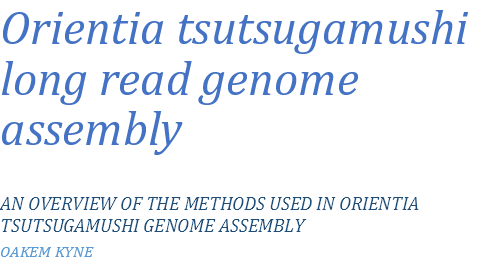
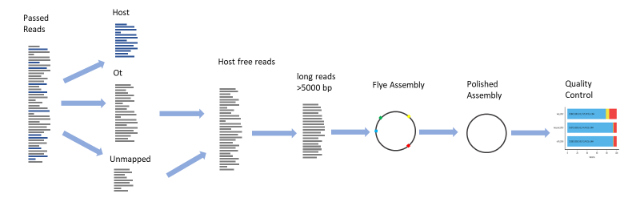
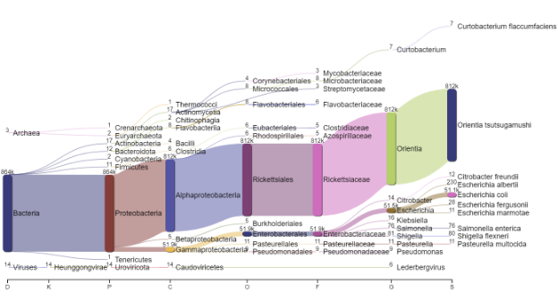
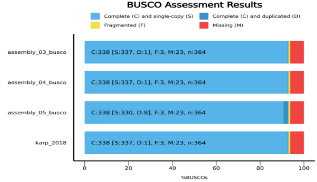
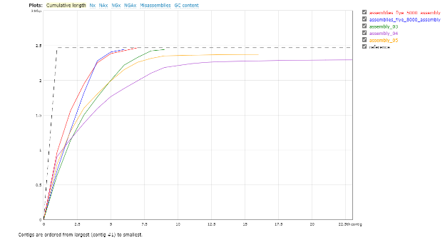
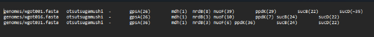



2024

Assembly Methodology
1. # **Table of Contents**
[2	Introduction	1](#_toc172713810)

[3	Nanopore QC	2](#_toc172713811)

[3.1	Run report	2](#_toc172713812)

[3.1.1	Software version and basecalling model	2](#_toc172713813)

[3.1.2	Data generation	2](#_toc172713814)

[3.2	PycoQC	2](#_toc172713815)

[3.2.1	Running pycoQC	2](#_toc172713816)

[3.2.2	Running pycoQC on individual barcodes	3](#_toc172713817)

[3.2.3	Interpreting the pycoQC output	3](#_toc172713818)

[4	File joining and transfer	3](#_toc172713819)

[5	Host read removal	3](#_toc172713820)

[6	Kraken2	4](#_toc172713821)

[7	Flye assembly	4](#_toc172713822)

[8	Medaka polishing	4](#_toc172713823)

[8.1	compare_assemblies.py	5](#_toc172713824)

[9	Assembly QC	5](#_toc172713825)

[9.1	BUSCO	5](#_toc172713826)

[9.2	Quast	6](#_toc172713827)

[9.3	MLST	6](#_toc172713828)

1. # **Introduction**
*Orientia tsutsugamushi* is especially challenging to sequence and assemble due to (1) its obligate intracellular lifecycle and (2) its highly repetitive genome. The intracellular lifecycle makes culturing and DNA extraction hard and means host reads are inevitable. Additionally, the repetitiveness necessitates long reads and optimised assembly methods.

1. # **Nanopore QC**
   1. ## **Run report**
      1. ### **Software version and basecalling model**
For Orientia we use **super high accurate** basecalling, 400 bps, as accuracy is crucial for the assemblies. If this is not set on the initial sequencing run, then the data should be rebasecalled.

It is also important to use an up-to-date basecalling model. As of Jul 2024 this is Dorado 7.3.9.

1. ### **Data generation**
To date (24/07/24) data generation is around 8 Giga bases. 

Variables affecting the amount of data generated:

1. Flowcell age and pore activity
1. Pore translocation speed, affected by things like contamination and temperature
1. Amount of DNA loaded
1. Washing the flow cell (I think this should always be done as it maximises the data output and is relatively cheap)

Warning messages are given in the file, so it is recommended to check these for possible ways to optimise the amount of data generated.

1. ## **PycoQC**
   1. ### **Running pycoQC**
pycoQC is a very simple package to run, requiring only the sequencing summary file and an active conda environment containing pycoQC. 

Usage:

`pycoQC -f path/to/file/sequencing\_summary\_file.txt -o output\_name.html --min\_pass\_qual 10`

The min\_pass\_qual should be modified based on the base calling model used, 10 is for the superhigh accuracy. The threshold to use can be found in the run report.

1. ### **Running pycoQC on individual barcodes**
To run pycoQC on individual barcodes, the sequencing summary file should first be split using; Barcode\_split from pycoQC. Run from a conda environment containing pycoQC.

Usage: `Barcode\_split --summary\_file path/to/file/summary\_file.txt --output\_dir OUTPUT\_DIR`

This produces individual sequencing summary files for each barcode. These can then be run through pycoQC and the barcode distributions can then be compared.

1. ### **Interpreting the pycoQC output**
The main use of pycoQC is to compare the read length distributions of barcodes. This is especially useful when performing read length optimisation. It is also useful for standard quality control, we try and optimise reads >10,000 base pairs.

1. # **File joining and transfer**
Having obtained the nanopore data, the passed reads should be transferred to the computing cluster. `scp` or `rsync` can be used for this (`rsync` will log the progress), this can take a while, especially when the vpn is running slowly.

On the cluster the .fastq.gz files should be joined into individual conditions/barcodes. This can be done with `cat` e.g. `cat barcodeX/\* barcodeX.fastq.gz`.

1. # **Environment Activation**
The correct environments need to be setup for assembly, these include:

1. minimap
1. assembly

The scripts in the 2\_assembly\_scripts/optimised\_assembly directory activate the correct conda environment. However, this is setup for my conda environment. **You will want to change** the `source /well/moru-batty/users/vhs789/miniforge/etc/profile.d/conda.sh` line for your conda system.
1. # **Host read removal**
Reads contain both *Orientia* and host cell (L929/mouse) DNA. In our DNA prep we extracted significant amounts of mouse DNA, this was sufficient to disrupt the assembly of the *Orientia* genome.

To remove these mouse reads we perform minimap2 competitive mapping against the mouse genome and karp genome (an *Orientia tsutsugamushi* strain), at the same time. Then unmapped and *Orientia* mapped reads are extracted for subsequent assembly.

1. # **[optional] Kraken2**
This can be performed as a quick way to check for cellular contamination. The information from it is very helpful to the Salje lab every now and then.

It is essential to remove the Dilute Control Sequence (the positive control in sequencing) and mouse reads (as there is no kraken2 database with both *Orientia* and mouse). A script for running kraken2 can be found in the github directory, this should be run from the cluster. Then pavian can be run in R to produce plots (like the one shown below).

*Figure 1 Kraken2 output visualised with Pavian (an R tool). This shows clearly a large number of Orientia reads. However, the run also contained the DCS used as a positive control and this results in lots of E. coli and related reads.*
1. # **Flye assembly**
Tests were performed with both CANU and Flye. Flye massively outperformed CANU requiring ~100x less CPU hours and producing more complete *Orientia* genomes.

Numerous tests found that by using reads roughly >5000 bp improved the contiguity of the resultant genome. This length threshold is consequently used in our assembles. Other parameters tested were --asm-coverage and --min-overlap but neither performed as well as prefiltering the read lengths (in terms of contig number and assembly size relative to reference).

When running flye (if not using my script) ensure that the parameter --nano-hq is used for nanopore reads.
1. # **Medaka polishing**
Medaka is a polishing package produced by Oxford Nanopore Technologies to correct errors in the initial assembly through multiple polishing iterations.

This should be run on all *Orientia*/non-mouse reads and not just those >5000 bp (the ones used in flye assembly).
1. ## **compare\_assemblies.py**
This script can be used to identify changes in the assemblies due to medaka polishing. The script can be found here: <https://github.com/rrwick/Perfect-bacterial-genome-tutorial/wiki/Comparing-assemblies> 

This can also be used to compare genome assemblies (e.g. different assembly methods). However, due to significant rearrangement observed in *Orientia* genomes, this script cannot effectively compare strains.
1. # **Assembly QC**
   1. ## **BUSCO**
BUSCO is a tool used to access the completeness of genome assemblies, by identifying the presence, absence, fragmentation or duplication of conserved single copy genes. 

One of the major limitations of this, is that the genome must be of very low quality to fail BUSCO tests. The main area that fails to assemble in *Orientia* genomes is the Rickettsiales Amplified Genetic Elements (RAGEs). As these regions don’t contain of the conserved single copy genes, the genome can be quite poorly assembled but still perform well in BUSCO.

It is also important to note the complete *Orientia* genomes don’t register as having all the conserved single copy genes. This is due to some gene loss in *Orientia* genome compared to the rickettsiales database.

*Figure 2 BUSCO results for three Orientia genome assemblies and the complete karp genome.*
1. ## **Quast**
Running quast on the new assemblies gives the cumulative length plot, a useful measure of how the lengths of assembly contigs are spread. Ideally, a genome should produce a right-angled shape, representing a single contig. If there are multiple contigs, the closer to the right-angled shape the better.

*Figure 3 Quast cumulative length plot for various flye assemblies.*
1. ## **MLST**
MLST (Multilocus Sequence Typing) can be employed in a manner similar to BUSCO, but it focuses on a different set of genes, specifically multiple housekeeping genes that are essential for the basic cellular functions and show enough variation to distinguish between strains. 

In theory the unique combinations of alleles identified through MLST offer insights into the genetic relatedness of new strains to existing ones. In practice, every *Orientia* genome has a different combination of alleles. 

